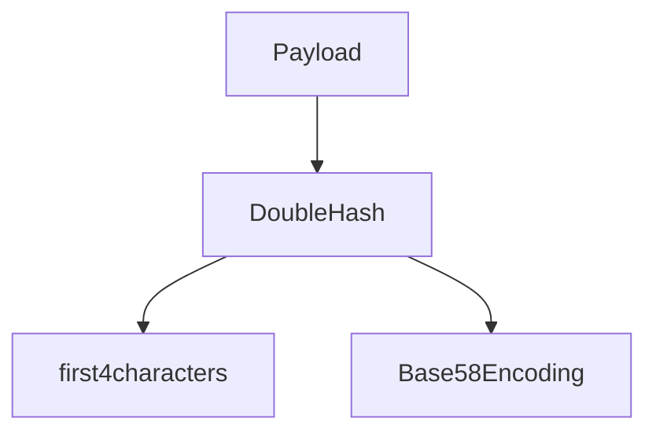

# base58Encoding

## This project is a part of my stduy bitcoin

With Mastring Bitcoin -PROGRAMMING THE OPEN BLOCKCHAIN- by Andreas M.Antonopoulos

```mermaid
graph TD;
    Payload-->DoubleHash;
    DoubleHash-->first4characters;
    DoubleHash-->Base58Encoding; 
```
